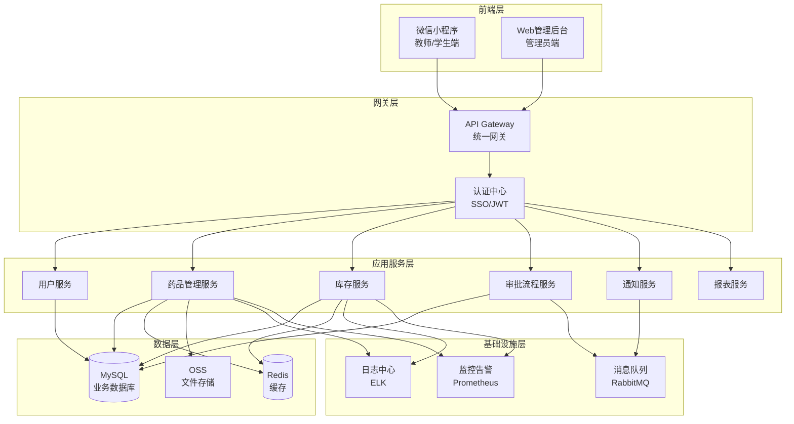
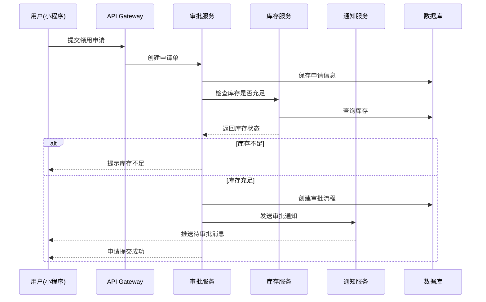
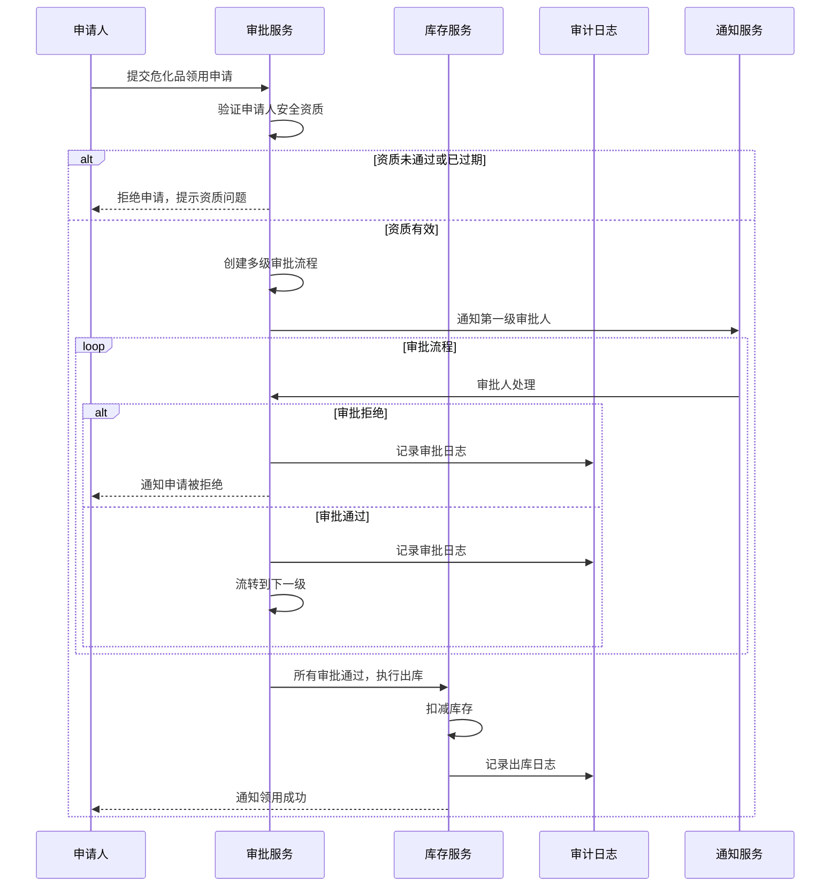
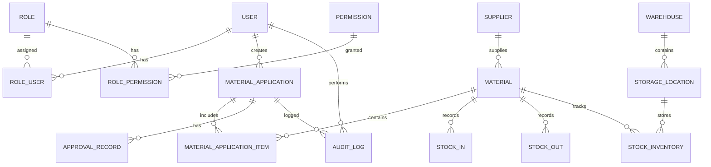

# 技术设计文档

## 概述

智慧实验室管理系统第一阶段聚焦于实验室药品管理系统，包括耗材、试剂和危化品的全生命周期管理。系统采用前后端分离架构，前端包括微信小程序（用户端）和Web管理后台（管理端），后端采用微服务架构，支持校内私有化部署。

### 系统目标

- 实现药品（耗材/试剂/危化品）的数字化台账管理
- 提供便捷的移动端领用申请和审批流程
- 确保危化品安全合规管理，满足监管要求
- 实现库存实时监控和智能预警
- 提供完整的审计日志和数据安全保障

### 技术原则

- 前后端分离，接口标准化
- 微服务架构，模块解耦
- 数据安全优先，操作可追溯
- 高可用性，支持横向扩展
- 私有化部署，数据自主可控

## 架构设计

### 系统架构图



### 技术栈选型

#### 前端技术栈

**微信小程序（用户端）**
- 框架：uni-app（支持跨平台，可扩展到支付宝小程序等）
- UI组件库：uView UI
- 状态管理：Vuex
- HTTP客户端：uni.request + axios适配器
- 特性：扫码功能、消息推送、位置服务

**Web管理后台（管理端）**
- 框架：Vue 3 + TypeScript
- UI组件库：Element Plus
- 状态管理：Pinia
- 路由：Vue Router 4
- HTTP客户端：Axios
- 图表库：ECharts
- 构建工具：Vite

#### 后端技术栈

**核心框架**
- 语言：Java 17
- 框架：Spring Boot 3.x
- 微服务：Spring Cloud Alibaba
- API文档：Knife4j (Swagger 3)
- 数据访问：MyBatis-Plus
- 安全框架：Spring Security + JWT

**数据存储**
- 关系数据库：MySQL 8.0（主数据存储）
- 缓存：Redis 7.x（会话、热点数据缓存）
- 文件存储：MinIO（私有化对象存储，存储图片、文档）

**中间件**
- 消息队列：RabbitMQ（异步任务、消息通知）
- 服务注册与发现：Nacos
- 配置中心：Nacos Config
- 网关：Spring Cloud Gateway

**基础设施**
- 日志：SLF4J + Logback，集中式日志ELK（Elasticsearch + Logback + Kibana）
- 监控：Prometheus + Grafana
- 链路追踪：SkyWalking
- 任务调度：XXL-Job

#### 部署架构

**私有化部署方案（推荐）**
- 容器化：Docker + Docker Compose（小规模）或 Kubernetes（大规模）
- 负载均衡：Nginx
- 数据库高可用：MySQL主从复制 + 读写分离
- 缓存高可用：Redis Sentinel
- 备份策略：每日全量备份 + 实时binlog备份

**服务器配置建议**
- 应用服务器：4核8G × 2台（支持500并发用户）
- 数据库服务器：8核16G × 1台（主库）+ 4核8G × 1台（从库）
- Redis服务器：2核4G × 1台
- 文件存储：500GB起步

## 核心模块设计

### 第一阶段模块划分

#### 1. 用户与权限模块
- 用户管理：用户信息、角色分配
- 权限管理：角色权限配置、菜单权限、数据权限
- 认证授权：SSO对接、JWT令牌管理
- 审计日志：操作日志记录与查询

#### 2. 药品基础信息管理模块
- 药品分类：耗材、试剂、危化品分类管理
- 药品档案：药品基本信息、规格、供应商
- 危化品标识：CAS号、危险类别、易制毒易制爆标记
- 存储位置：仓库、货架位置管理

#### 3. 库存管理模块
- 入库管理：采购入库、捐赠入库、退库入库
- 出库管理：领用出库、报废出库、调拨出库
- 库存查询：实时库存、库存流水、库存盘点
- 库存预警：安全库存预警、有效期预警、异常消耗预警

#### 4. 领用申请与审批模块
- 申请管理：领用申请创建、申请单查询
- 审批流程：多级审批配置、审批处理、审批历史
- 危化品审批：危化品专项审批、用途审核
- 归还管理：危化品归还登记、实际使用量记录

#### 5. 通知与消息模块
- 消息中心：站内消息、消息推送
- 通知配置：通知类型配置、推送渠道配置
- 待办事项：待审批事项、待处理任务

#### 6. 报表与统计模块
- 库存报表：库存汇总表、库存明细表
- 消耗统计：月度消耗统计、成本分析
- 危化品台账：危化品清单、领用记录、账实对比
- 审计报表：操作日志报表、异常预警报表

### 模块交互流程

#### 药品领用流程



#### 危化品审批与出库流程



## 数据模型设计

### 数据库ER图



### 核心数据表设计

#### 1. 用户与权限表

**用户表 (sys_user)**
```sql
CREATE TABLE sys_user (
    id BIGINT PRIMARY KEY AUTO_INCREMENT COMMENT '用户ID',
    username VARCHAR(50) NOT NULL UNIQUE COMMENT '用户名',
    password VARCHAR(255) NOT NULL COMMENT '密码(加密)',
    real_name VARCHAR(50) NOT NULL COMMENT '真实姓名',
    phone VARCHAR(20) COMMENT '手机号',
    email VARCHAR(100) COMMENT '邮箱',
    user_type TINYINT NOT NULL COMMENT '用户类型:1-管理员,2-教师,3-学生',
    department VARCHAR(100) COMMENT '所属部门',
    status TINYINT DEFAULT 1 COMMENT '状态:0-禁用,1-启用',
    safety_cert_status TINYINT DEFAULT 0 COMMENT '安全资质:0-未认证,1-已认证',
    safety_cert_expire_date DATE COMMENT '安全资质到期日期',
    created_by BIGINT COMMENT '创建人',
    created_time DATETIME DEFAULT CURRENT_TIMESTAMP COMMENT '创建时间',
    updated_by BIGINT COMMENT '更新人',
    updated_time DATETIME DEFAULT CURRENT_TIMESTAMP ON UPDATE CURRENT_TIMESTAMP COMMENT '更新时间',
    deleted TINYINT DEFAULT 0 COMMENT '删除标记:0-未删除,1-已删除',
    INDEX idx_username (username),
    INDEX idx_user_type (user_type),
    INDEX idx_status (status)
) ENGINE=InnoDB DEFAULT CHARSET=utf8mb4 COMMENT='用户表';
```

**角色表 (sys_role)**
```sql
CREATE TABLE sys_role (
    id BIGINT PRIMARY KEY AUTO_INCREMENT COMMENT '角色ID',
    role_code VARCHAR(50) NOT NULL UNIQUE COMMENT '角色编码',
    role_name VARCHAR(50) NOT NULL COMMENT '角色名称',
    description VARCHAR(200) COMMENT '角色描述',
    status TINYINT DEFAULT 1 COMMENT '状态:0-禁用,1-启用',
    created_time DATETIME DEFAULT CURRENT_TIMESTAMP COMMENT '创建时间',
    updated_time DATETIME DEFAULT CURRENT_TIMESTAMP ON UPDATE CURRENT_TIMESTAMP COMMENT '更新时间',
    deleted TINYINT DEFAULT 0 COMMENT '删除标记'
) ENGINE=InnoDB DEFAULT CHARSET=utf8mb4 COMMENT='角色表';
```

**用户角色关联表 (sys_user_role)**
```sql
CREATE TABLE sys_user_role (
    id BIGINT PRIMARY KEY AUTO_INCREMENT COMMENT 'ID',
    user_id BIGINT NOT NULL COMMENT '用户ID',
    role_id BIGINT NOT NULL COMMENT '角色ID',
    created_time DATETIME DEFAULT CURRENT_TIMESTAMP COMMENT '创建时间',
    UNIQUE KEY uk_user_role (user_id, role_id),
    INDEX idx_user_id (user_id),
    INDEX idx_role_id (role_id)
) ENGINE=InnoDB DEFAULT CHARSET=utf8mb4 COMMENT='用户角色关联表';
```

**权限表 (sys_permission)**
```sql
CREATE TABLE sys_permission (
    id BIGINT PRIMARY KEY AUTO_INCREMENT COMMENT '权限ID',
    permission_code VARCHAR(100) NOT NULL UNIQUE COMMENT '权限编码',
    permission_name VARCHAR(100) NOT NULL COMMENT '权限名称',
    permission_type TINYINT NOT NULL COMMENT '权限类型:1-菜单,2-按钮,3-接口',
    parent_id BIGINT DEFAULT 0 COMMENT '父权限ID',
    path VARCHAR(200) COMMENT '路由路径',
    component VARCHAR(200) COMMENT '组件路径',
    icon VARCHAR(100) COMMENT '图标',
    sort_order INT DEFAULT 0 COMMENT '排序',
    status TINYINT DEFAULT 1 COMMENT '状态:0-禁用,1-启用',
    created_time DATETIME DEFAULT CURRENT_TIMESTAMP COMMENT '创建时间',
    updated_time DATETIME DEFAULT CURRENT_TIMESTAMP ON UPDATE CURRENT_TIMESTAMP COMMENT '更新时间'
) ENGINE=InnoDB DEFAULT CHARSET=utf8mb4 COMMENT='权限表';
```

**角色权限关联表 (sys_role_permission)**
```sql
CREATE TABLE sys_role_permission (
    id BIGINT PRIMARY KEY AUTO_INCREMENT COMMENT 'ID',
    role_id BIGINT NOT NULL COMMENT '角色ID',
    permission_id BIGINT NOT NULL COMMENT '权限ID',
    created_time DATETIME DEFAULT CURRENT_TIMESTAMP COMMENT '创建时间',
    UNIQUE KEY uk_role_permission (role_id, permission_id),
    INDEX idx_role_id (role_id),
    INDEX idx_permission_id (permission_id)
) ENGINE=InnoDB DEFAULT CHARSET=utf8mb4 COMMENT='角色权限关联表';
```

#### 2. 药品管理核心表

**药品分类表 (material_category)**
```sql
CREATE TABLE material_category (
    id BIGINT PRIMARY KEY AUTO_INCREMENT COMMENT '分类ID',
    category_code VARCHAR(50) NOT NULL UNIQUE COMMENT '分类编码',
    category_name VARCHAR(100) NOT NULL COMMENT '分类名称',
    parent_id BIGINT DEFAULT 0 COMMENT '父分类ID',
    category_level TINYINT NOT NULL COMMENT '分类层级:1-一级,2-二级,3-三级',
    sort_order INT DEFAULT 0 COMMENT '排序',
    description VARCHAR(500) COMMENT '分类描述',
    created_time DATETIME DEFAULT CURRENT_TIMESTAMP COMMENT '创建时间',
    updated_time DATETIME DEFAULT CURRENT_TIMESTAMP ON UPDATE CURRENT_TIMESTAMP COMMENT '更新时间',
    deleted TINYINT DEFAULT 0 COMMENT '删除标记',
    INDEX idx_parent_id (parent_id),
    INDEX idx_category_code (category_code)
) ENGINE=InnoDB DEFAULT CHARSET=utf8mb4 COMMENT='药品分类表';
```

**药品信息表 (material)**
```sql
CREATE TABLE material (
    id BIGINT PRIMARY KEY AUTO_INCREMENT COMMENT '药品ID',
    material_code VARCHAR(50) NOT NULL UNIQUE COMMENT '药品编码',
    material_name VARCHAR(200) NOT NULL COMMENT '药品名称',
    material_type TINYINT NOT NULL COMMENT '药品类型:1-耗材,2-试剂,3-危化品',
    category_id BIGINT NOT NULL COMMENT '分类ID',
    specification VARCHAR(100) COMMENT '规格型号',
    unit VARCHAR(20) NOT NULL COMMENT '单位',
    cas_number VARCHAR(50) COMMENT 'CAS号(化学品)',
    danger_category VARCHAR(100) COMMENT '危险类别',
    is_controlled TINYINT DEFAULT 0 COMMENT '是否管控:0-否,1-易制毒,2-易制爆',
    supplier_id BIGINT COMMENT '供应商ID',
    unit_price DECIMAL(10,2) COMMENT '单价',
    safety_stock INT DEFAULT 0 COMMENT '安全库存',
    max_stock INT COMMENT '最大库存',
    storage_condition VARCHAR(200) COMMENT '储存条件',
    shelf_life_days INT COMMENT '保质期(天)',
    description TEXT COMMENT '描述',
    image_url VARCHAR(500) COMMENT '图片URL',
    status TINYINT DEFAULT 1 COMMENT '状态:0-停用,1-启用',
    created_by BIGINT COMMENT '创建人',
    created_time DATETIME DEFAULT CURRENT_TIMESTAMP COMMENT '创建时间',
    updated_by BIGINT COMMENT '更新人',
    updated_time DATETIME DEFAULT CURRENT_TIMESTAMP ON UPDATE CURRENT_TIMESTAMP COMMENT '更新时间',
    deleted TINYINT DEFAULT 0 COMMENT '删除标记',
    INDEX idx_material_code (material_code),
    INDEX idx_material_type (material_type),
    INDEX idx_category_id (category_id),
    INDEX idx_is_controlled (is_controlled),
    INDEX idx_material_name (material_name)
) ENGINE=InnoDB DEFAULT CHARSET=utf8mb4 COMMENT='药品信息表';
```

**供应商表 (supplier)**
```sql
CREATE TABLE supplier (
    id BIGINT PRIMARY KEY AUTO_INCREMENT COMMENT '供应商ID',
    supplier_code VARCHAR(50) NOT NULL UNIQUE COMMENT '供应商编码',
    supplier_name VARCHAR(200) NOT NULL COMMENT '供应商名称',
    contact_person VARCHAR(50) COMMENT '联系人',
    contact_phone VARCHAR(20) COMMENT '联系电话',
    contact_email VARCHAR(100) COMMENT '联系邮箱',
    address VARCHAR(500) COMMENT '地址',
    qualification_file VARCHAR(500) COMMENT '资质文件URL',
    status TINYINT DEFAULT 1 COMMENT '状态:0-停用,1-启用',
    created_time DATETIME DEFAULT CURRENT_TIMESTAMP COMMENT '创建时间',
    updated_time DATETIME DEFAULT CURRENT_TIMESTAMP ON UPDATE CURRENT_TIMESTAMP COMMENT '更新时间',
    deleted TINYINT DEFAULT 0 COMMENT '删除标记',
    INDEX idx_supplier_code (supplier_code)
) ENGINE=InnoDB DEFAULT CHARSET=utf8mb4 COMMENT='供应商表';
```

#### 3. 库存管理表

**仓库表 (warehouse)**
```sql
CREATE TABLE warehouse (
    id BIGINT PRIMARY KEY AUTO_INCREMENT COMMENT '仓库ID',
    warehouse_code VARCHAR(50) NOT NULL UNIQUE COMMENT '仓库编码',
    warehouse_name VARCHAR(100) NOT NULL COMMENT '仓库名称',
    warehouse_type TINYINT NOT NULL COMMENT '仓库类型:1-普通仓库,2-危化品仓库',
    location VARCHAR(200) COMMENT '位置',
    manager_id BIGINT COMMENT '负责人ID',
    status TINYINT DEFAULT 1 COMMENT '状态:0-停用,1-启用',
    created_time DATETIME DEFAULT CURRENT_TIMESTAMP COMMENT '创建时间',
    updated_time DATETIME DEFAULT CURRENT_TIMESTAMP ON UPDATE CURRENT_TIMESTAMP COMMENT '更新时间',
    deleted TINYINT DEFAULT 0 COMMENT '删除标记',
    INDEX idx_warehouse_code (warehouse_code)
) ENGINE=InnoDB DEFAULT CHARSET=utf8mb4 COMMENT='仓库表';
```

**存储位置表 (storage_location)**
```sql
CREATE TABLE storage_location (
    id BIGINT PRIMARY KEY AUTO_INCREMENT COMMENT '位置ID',
    warehouse_id BIGINT NOT NULL COMMENT '仓库ID',
    location_code VARCHAR(50) NOT NULL COMMENT '位置编码',
    location_name VARCHAR(100) NOT NULL COMMENT '位置名称',
    shelf_number VARCHAR(50) COMMENT '货架号',
    layer_number VARCHAR(50) COMMENT '层号',
    status TINYINT DEFAULT 1 COMMENT '状态:0-停用,1-启用',
    created_time DATETIME DEFAULT CURRENT_TIMESTAMP COMMENT '创建时间',
    updated_time DATETIME DEFAULT CURRENT_TIMESTAMP ON UPDATE CURRENT_TIMESTAMP COMMENT '更新时间',
    deleted TINYINT DEFAULT 0 COMMENT '删除标记',
    UNIQUE KEY uk_warehouse_location (warehouse_id, location_code),
    INDEX idx_warehouse_id (warehouse_id)
) ENGINE=InnoDB DEFAULT CHARSET=utf8mb4 COMMENT='存储位置表';
```

**库存表 (stock_inventory)**
```sql
CREATE TABLE stock_inventory (
    id BIGINT PRIMARY KEY AUTO_INCREMENT COMMENT '库存ID',
    material_id BIGINT NOT NULL COMMENT '药品ID',
    warehouse_id BIGINT NOT NULL COMMENT '仓库ID',
    storage_location_id BIGINT COMMENT '存储位置ID',
    batch_number VARCHAR(50) COMMENT '批次号',
    quantity DECIMAL(10,2) NOT NULL DEFAULT 0 COMMENT '库存数量',
    available_quantity DECIMAL(10,2) NOT NULL DEFAULT 0 COMMENT '可用数量',
    locked_quantity DECIMAL(10,2) NOT NULL DEFAULT 0 COMMENT '锁定数量',
    production_date DATE COMMENT '生产日期',
    expire_date DATE COMMENT '有效期至',
    unit_price DECIMAL(10,2) COMMENT '单价',
    total_amount DECIMAL(12,2) COMMENT '总金额',
    last_check_date DATE COMMENT '最后盘点日期',
    created_time DATETIME DEFAULT CURRENT_TIMESTAMP COMMENT '创建时间',
    updated_time DATETIME DEFAULT CURRENT_TIMESTAMP ON UPDATE CURRENT_TIMESTAMP COMMENT '更新时间',
    UNIQUE KEY uk_material_warehouse_batch (material_id, warehouse_id, batch_number),
    INDEX idx_material_id (material_id),
    INDEX idx_warehouse_id (warehouse_id),
    INDEX idx_expire_date (expire_date)
) ENGINE=InnoDB DEFAULT CHARSET=utf8mb4 COMMENT='库存表';
```

**入库单表 (stock_in)**
```sql
CREATE TABLE stock_in (
    id BIGINT PRIMARY KEY AUTO_INCREMENT COMMENT '入库单ID',
    in_order_no VARCHAR(50) NOT NULL UNIQUE COMMENT '入库单号',
    in_type TINYINT NOT NULL COMMENT '入库类型:1-采购入库,2-退库入库,3-其他入库',
    warehouse_id BIGINT NOT NULL COMMENT '仓库ID',
    supplier_id BIGINT COMMENT '供应商ID',
    total_amount DECIMAL(12,2) COMMENT '总金额',
    in_date DATE NOT NULL COMMENT '入库日期',
    operator_id BIGINT NOT NULL COMMENT '经手人ID',
    status TINYINT DEFAULT 1 COMMENT '状态:1-待入库,2-已入库,3-已取消',
    remark TEXT COMMENT '备注',
    attachment_url VARCHAR(500) COMMENT '附件URL',
    created_by BIGINT COMMENT '创建人',
    created_time DATETIME DEFAULT CURRENT_TIMESTAMP COMMENT '创建时间',
    updated_by BIGINT COMMENT '更新人',
    updated_time DATETIME DEFAULT CURRENT_TIMESTAMP ON UPDATE CURRENT_TIMESTAMP COMMENT '更新时间',
    deleted TINYINT DEFAULT 0 COMMENT '删除标记',
    INDEX idx_in_order_no (in_order_no),
    INDEX idx_warehouse_id (warehouse_id),
    INDEX idx_in_date (in_date),
    INDEX idx_status (status)
) ENGINE=InnoDB DEFAULT CHARSET=utf8mb4 COMMENT='入库单表';
```

**入库单明细表 (stock_in_detail)**
```sql
CREATE TABLE stock_in_detail (
    id BIGINT PRIMARY KEY AUTO_INCREMENT COMMENT '明细ID',
    in_order_id BIGINT NOT NULL COMMENT '入库单ID',
    material_id BIGINT NOT NULL COMMENT '药品ID',
    batch_number VARCHAR(50) COMMENT '批次号',
    quantity DECIMAL(10,2) NOT NULL COMMENT '入库数量',
    unit_price DECIMAL(10,2) COMMENT '单价',
    total_amount DECIMAL(12,2) COMMENT '金额',
    production_date DATE COMMENT '生产日期',
    expire_date DATE COMMENT '有效期至',
    storage_location_id BIGINT COMMENT '存储位置ID',
    created_time DATETIME DEFAULT CURRENT_TIMESTAMP COMMENT '创建时间',
    INDEX idx_in_order_id (in_order_id),
    INDEX idx_material_id (material_id)
) ENGINE=InnoDB DEFAULT CHARSET=utf8mb4 COMMENT='入库单明细表';
```

**出库单表 (stock_out)**
```sql
CREATE TABLE stock_out (
    id BIGINT PRIMARY KEY AUTO_INCREMENT COMMENT '出库单ID',
    out_order_no VARCHAR(50) NOT NULL UNIQUE COMMENT '出库单号',
    out_type TINYINT NOT NULL COMMENT '出库类型:1-领用出库,2-报废出库,3-调拨出库',
    warehouse_id BIGINT NOT NULL COMMENT '仓库ID',
    application_id BIGINT COMMENT '关联申请单ID',
    receiver_id BIGINT COMMENT '领用人ID',
    receiver_name VARCHAR(50) COMMENT '领用人姓名',
    receiver_dept VARCHAR(100) COMMENT '领用部门',
    out_date DATE NOT NULL COMMENT '出库日期',
    operator_id BIGINT NOT NULL COMMENT '经手人ID',
    status TINYINT DEFAULT 1 COMMENT '状态:1-待出库,2-已出库,3-已取消',
    remark TEXT COMMENT '备注',
    created_by BIGINT COMMENT '创建人',
    created_time DATETIME DEFAULT CURRENT_TIMESTAMP COMMENT '创建时间',
    updated_by BIGINT COMMENT '更新人',
    updated_time DATETIME DEFAULT CURRENT_TIMESTAMP ON UPDATE CURRENT_TIMESTAMP COMMENT '更新时间',
    deleted TINYINT DEFAULT 0 COMMENT '删除标记',
    INDEX idx_out_order_no (out_order_no),
    INDEX idx_warehouse_id (warehouse_id),
    INDEX idx_application_id (application_id),
    INDEX idx_out_date (out_date),
    INDEX idx_status (status)
) ENGINE=InnoDB DEFAULT CHARSET=utf8mb4 COMMENT='出库单表';
```

**出库单明细表 (stock_out_detail)**
```sql
CREATE TABLE stock_out_detail (
    id BIGINT PRIMARY KEY AUTO_INCREMENT COMMENT '明细ID',
    out_order_id BIGINT NOT NULL COMMENT '出库单ID',
    material_id BIGINT NOT NULL COMMENT '药品ID',
    batch_number VARCHAR(50) COMMENT '批次号',
    quantity DECIMAL(10,2) NOT NULL COMMENT '出库数量',
    unit_price DECIMAL(10,2) COMMENT '单价',
    total_amount DECIMAL(12,2) COMMENT '金额',
    storage_location_id BIGINT COMMENT '存储位置ID',
    created_time DATETIME DEFAULT CURRENT_TIMESTAMP COMMENT '创建时间',
    INDEX idx_out_order_id (out_order_id),
    INDEX idx_material_id (material_id)
) ENGINE=InnoDB DEFAULT CHARSET=utf8mb4 COMMENT='出库单明细表';
```

**库存盘点表 (stock_check)**
```sql
CREATE TABLE stock_check (
    id BIGINT PRIMARY KEY AUTO_INCREMENT COMMENT '盘点ID',
    check_no VARCHAR(50) NOT NULL UNIQUE COMMENT '盘点单号',
    warehouse_id BIGINT NOT NULL COMMENT '仓库ID',
    check_date DATE NOT NULL COMMENT '盘点日期',
    checker_id BIGINT NOT NULL COMMENT '盘点人ID',
    status TINYINT DEFAULT 1 COMMENT '状态:1-盘点中,2-已完成',
    remark TEXT COMMENT '备注',
    created_by BIGINT COMMENT '创建人',
    created_time DATETIME DEFAULT CURRENT_TIMESTAMP COMMENT '创建时间',
    updated_time DATETIME DEFAULT CURRENT_TIMESTAMP ON UPDATE CURRENT_TIMESTAMP COMMENT '更新时间',
    deleted TINYINT DEFAULT 0 COMMENT '删除标记',
    INDEX idx_check_no (check_no),
    INDEX idx_warehouse_id (warehouse_id),
    INDEX idx_check_date (check_date)
) ENGINE=InnoDB DEFAULT CHARSET=utf8mb4 COMMENT='库存盘点表';
```

**库存盘点明细表 (stock_check_detail)**
```sql
CREATE TABLE stock_check_detail (
    id BIGINT PRIMARY KEY AUTO_INCREMENT COMMENT '明细ID',
    check_id BIGINT NOT NULL COMMENT '盘点ID',
    material_id BIGINT NOT NULL COMMENT '药品ID',
    batch_number VARCHAR(50) COMMENT '批次号',
    book_quantity DECIMAL(10,2) NOT NULL COMMENT '账面数量',
    actual_quantity DECIMAL(10,2) NOT NULL COMMENT '实际数量',
    diff_quantity DECIMAL(10,2) NOT NULL COMMENT '差异数量',
    diff_reason VARCHAR(500) COMMENT '差异原因',
    storage_location_id BIGINT COMMENT '存储位置ID',
    created_time DATETIME DEFAULT CURRENT_TIMESTAMP COMMENT '创建时间',
    INDEX idx_check_id (check_id),
    INDEX idx_material_id (material_id)
) ENGINE=InnoDB DEFAULT CHARSET=utf8mb4 COMMENT='库存盘点明细表';
```

#### 4. 领用申请与审批表

**领用申请单表 (material_application)**
```sql
CREATE TABLE material_application (
    id BIGINT PRIMARY KEY AUTO_INCREMENT COMMENT '申请单ID',
    application_no VARCHAR(50) NOT NULL UNIQUE COMMENT '申请单号',
    applicant_id BIGINT NOT NULL COMMENT '申请人ID',
    applicant_name VARCHAR(50) NOT NULL COMMENT '申请人姓名',
    applicant_dept VARCHAR(100) COMMENT '申请部门',
    application_type TINYINT NOT NULL COMMENT '申请类型:1-普通领用,2-危化品领用',
    usage_purpose VARCHAR(500) NOT NULL COMMENT '用途说明',
    usage_location VARCHAR(200) COMMENT '使用地点',
    expected_date DATE COMMENT '期望领用日期',
    status TINYINT DEFAULT 1 COMMENT '状态:1-待审批,2-审批中,3-审批通过,4-审批拒绝,5-已出库,6-已完成,7-已取消',
    approval_status TINYINT DEFAULT 0 COMMENT '审批状态:0-未审批,1-审批中,2-审批通过,3-审批拒绝',
    current_approver_id BIGINT COMMENT '当前审批人ID',
    remark TEXT COMMENT '备注',
    created_by BIGINT COMMENT '创建人',
    created_time DATETIME DEFAULT CURRENT_TIMESTAMP COMMENT '创建时间',
    updated_by BIGINT COMMENT '更新人',
    updated_time DATETIME DEFAULT CURRENT_TIMESTAMP ON UPDATE CURRENT_TIMESTAMP COMMENT '更新时间',
    deleted TINYINT DEFAULT 0 COMMENT '删除标记',
    INDEX idx_application_no (application_no),
    INDEX idx_applicant_id (applicant_id),
    INDEX idx_status (status),
    INDEX idx_approval_status (approval_status),
    INDEX idx_created_time (created_time)
) ENGINE=InnoDB DEFAULT CHARSET=utf8mb4 COMMENT='领用申请单表';
```

**领用申请明细表 (material_application_item)**
```sql
CREATE TABLE material_application_item (
    id BIGINT PRIMARY KEY AUTO_INCREMENT COMMENT '明细ID',
    application_id BIGINT NOT NULL COMMENT '申请单ID',
    material_id BIGINT NOT NULL COMMENT '药品ID',
    material_name VARCHAR(200) NOT NULL COMMENT '药品名称',
    specification VARCHAR(100) COMMENT '规格',
    unit VARCHAR(20) NOT NULL COMMENT '单位',
    apply_quantity DECIMAL(10,2) NOT NULL COMMENT '申请数量',
    approved_quantity DECIMAL(10,2) COMMENT '批准数量',
    actual_quantity DECIMAL(10,2) COMMENT '实际出库数量',
    remark VARCHAR(500) COMMENT '备注',
    created_time DATETIME DEFAULT CURRENT_TIMESTAMP COMMENT '创建时间',
    INDEX idx_application_id (application_id),
    INDEX idx_material_id (material_id)
) ENGINE=InnoDB DEFAULT CHARSET=utf8mb4 COMMENT='领用申请明细表';
```

**审批流程配置表 (approval_flow_config)**
```sql
CREATE TABLE approval_flow_config (
    id BIGINT PRIMARY KEY AUTO_INCREMENT COMMENT '配置ID',
    flow_code VARCHAR(50) NOT NULL UNIQUE COMMENT '流程编码',
    flow_name VARCHAR(100) NOT NULL COMMENT '流程名称',
    business_type TINYINT NOT NULL COMMENT '业务类型:1-普通领用,2-危化品领用',
    flow_definition TEXT NOT NULL COMMENT '流程定义(JSON)',
    status TINYINT DEFAULT 1 COMMENT '状态:0-停用,1-启用',
    created_time DATETIME DEFAULT CURRENT_TIMESTAMP COMMENT '创建时间',
    updated_time DATETIME DEFAULT CURRENT_TIMESTAMP ON UPDATE CURRENT_TIMESTAMP COMMENT '更新时间',
    INDEX idx_flow_code (flow_code),
    INDEX idx_business_type (business_type)
) ENGINE=InnoDB DEFAULT CHARSET=utf8mb4 COMMENT='审批流程配置表';
```

**审批记录表 (approval_record)**
```sql
CREATE TABLE approval_record (
    id BIGINT PRIMARY KEY AUTO_INCREMENT COMMENT '记录ID',
    application_id BIGINT NOT NULL COMMENT '申请单ID',
    application_no VARCHAR(50) NOT NULL COMMENT '申请单号',
    approver_id BIGINT NOT NULL COMMENT '审批人ID',
    approver_name VARCHAR(50) NOT NULL COMMENT '审批人姓名',
    approval_level INT NOT NULL COMMENT '审批层级',
    approval_result TINYINT NOT NULL COMMENT '审批结果:1-通过,2-拒绝',
    approval_opinion TEXT COMMENT '审批意见',
    approval_time DATETIME NOT NULL COMMENT '审批时间',
    created_time DATETIME DEFAULT CURRENT_TIMESTAMP COMMENT '创建时间',
    INDEX idx_application_id (application_id),
    INDEX idx_approver_id (approver_id),
    INDEX idx_approval_time (approval_time)
) ENGINE=InnoDB DEFAULT CHARSET=utf8mb4 COMMENT='审批记录表';
```

**危化品使用记录表 (hazardous_usage_record)**
```sql
CREATE TABLE hazardous_usage_record (
    id BIGINT PRIMARY KEY AUTO_INCREMENT COMMENT '记录ID',
    application_id BIGINT NOT NULL COMMENT '申请单ID',
    material_id BIGINT NOT NULL COMMENT '药品ID',
    user_id BIGINT NOT NULL COMMENT '使用人ID',
    user_name VARCHAR(50) NOT NULL COMMENT '使用人姓名',
    received_quantity DECIMAL(10,2) NOT NULL COMMENT '领用数量',
    actual_used_quantity DECIMAL(10,2) COMMENT '实际使用数量',
    returned_quantity DECIMAL(10,2) COMMENT '归还数量',
    waste_quantity DECIMAL(10,2) COMMENT '废弃数量',
    usage_date DATE NOT NULL COMMENT '使用日期',
    return_date DATE COMMENT '归还日期',
    usage_location VARCHAR(200) COMMENT '使用地点',
    usage_purpose VARCHAR(500) COMMENT '使用目的',
    status TINYINT DEFAULT 1 COMMENT '状态:1-使用中,2-已归还,3-已完成',
    remark TEXT COMMENT '备注',
    created_time DATETIME DEFAULT CURRENT_TIMESTAMP COMMENT '创建时间',
    updated_time DATETIME DEFAULT CURRENT_TIMESTAMP ON UPDATE CURRENT_TIMESTAMP COMMENT '更新时间',
    INDEX idx_application_id (application_id),
    INDEX idx_material_id (material_id),
    INDEX idx_user_id (user_id),
    INDEX idx_usage_date (usage_date)
) ENGINE=InnoDB DEFAULT CHARSET=utf8mb4 COMMENT='危化品使用记录表';
```

#### 5. 预警与通知表

**库存预警配置表 (stock_alert_config)**
```sql
CREATE TABLE stock_alert_config (
    id BIGINT PRIMARY KEY AUTO_INCREMENT COMMENT '配置ID',
    material_id BIGINT NOT NULL COMMENT '药品ID',
    alert_type TINYINT NOT NULL COMMENT '预警类型:1-低库存,2-有效期,3-异常消耗',
    threshold_value DECIMAL(10,2) COMMENT '阈值',
    alert_days INT COMMENT '提前预警天数',
    status TINYINT DEFAULT 1 COMMENT '状态:0-停用,1-启用',
    created_time DATETIME DEFAULT CURRENT_TIMESTAMP COMMENT '创建时间',
    updated_time DATETIME DEFAULT CURRENT_TIMESTAMP ON UPDATE CURRENT_TIMESTAMP COMMENT '更新时间',
    UNIQUE KEY uk_material_alert (material_id, alert_type),
    INDEX idx_material_id (material_id)
) ENGINE=InnoDB DEFAULT CHARSET=utf8mb4 COMMENT='库存预警配置表';
```

**预警记录表 (alert_record)**
```sql
CREATE TABLE alert_record (
    id BIGINT PRIMARY KEY AUTO_INCREMENT COMMENT '记录ID',
    alert_type TINYINT NOT NULL COMMENT '预警类型:1-低库存,2-有效期,3-异常消耗,4-账实差异,5-资质过期',
    alert_level TINYINT NOT NULL COMMENT '预警级别:1-提示,2-警告,3-严重',
    business_type VARCHAR(50) NOT NULL COMMENT '业务类型',
    business_id BIGINT COMMENT '业务ID',
    alert_title VARCHAR(200) NOT NULL COMMENT '预警标题',
    alert_content TEXT NOT NULL COMMENT '预警内容',
    alert_time DATETIME NOT NULL COMMENT '预警时间',
    status TINYINT DEFAULT 1 COMMENT '状态:1-未处理,2-已处理,3-已忽略',
    handler_id BIGINT COMMENT '处理人ID',
    handle_time DATETIME COMMENT '处理时间',
    handle_remark TEXT COMMENT '处理说明',
    created_time DATETIME DEFAULT CURRENT_TIMESTAMP COMMENT '创建时间',
    INDEX idx_alert_type (alert_type),
    INDEX idx_alert_level (alert_level),
    INDEX idx_status (status),
    INDEX idx_alert_time (alert_time)
) ENGINE=InnoDB DEFAULT CHARSET=utf8mb4 COMMENT='预警记录表';
```

**消息通知表 (notification)**
```sql
CREATE TABLE notification (
    id BIGINT PRIMARY KEY AUTO_INCREMENT COMMENT '通知ID',
    receiver_id BIGINT NOT NULL COMMENT '接收人ID',
    notification_type TINYINT NOT NULL COMMENT '通知类型:1-审批,2-预警,3-系统',
    title VARCHAR(200) NOT NULL COMMENT '标题',
    content TEXT NOT NULL COMMENT '内容',
    business_type VARCHAR(50) COMMENT '业务类型',
    business_id BIGINT COMMENT '业务ID',
    push_channel TINYINT DEFAULT 1 COMMENT '推送渠道:1-站内,2-微信,3-短信,4-邮件',
    is_read TINYINT DEFAULT 0 COMMENT '是否已读:0-未读,1-已读',
    read_time DATETIME COMMENT '阅读时间',
    created_time DATETIME DEFAULT CURRENT_TIMESTAMP COMMENT '创建时间',
    INDEX idx_receiver_id (receiver_id),
    INDEX idx_is_read (is_read),
    INDEX idx_notification_type (notification_type),
    INDEX idx_created_time (created_time)
) ENGINE=InnoDB DEFAULT CHARSET=utf8mb4 COMMENT='消息通知表';
```

#### 6. 审计日志表

**操作日志表 (audit_log)**
```sql
CREATE TABLE audit_log (
    id BIGINT PRIMARY KEY AUTO_INCREMENT COMMENT '日志ID',
    user_id BIGINT COMMENT '操作人ID',
    username VARCHAR(50) COMMENT '操作人用户名',
    real_name VARCHAR(50) COMMENT '操作人姓名',
    operation_type VARCHAR(50) NOT NULL COMMENT '操作类型',
    business_type VARCHAR(50) NOT NULL COMMENT '业务类型',
    business_id BIGINT COMMENT '业务ID',
    operation_desc VARCHAR(500) NOT NULL COMMENT '操作描述',
    request_method VARCHAR(10) COMMENT '请求方法',
    request_url VARCHAR(500) COMMENT '请求URL',
    request_params TEXT COMMENT '请求参数',
    response_result TEXT COMMENT '响应结果',
    ip_address VARCHAR(50) COMMENT 'IP地址',
    user_agent VARCHAR(500) COMMENT '用户代理',
    operation_time DATETIME NOT NULL COMMENT '操作时间',
    execution_time INT COMMENT '执行时长(ms)',
    status TINYINT DEFAULT 1 COMMENT '状态:1-成功,2-失败',
    error_message TEXT COMMENT '错误信息',
    created_time DATETIME DEFAULT CURRENT_TIMESTAMP COMMENT '创建时间',
    INDEX idx_user_id (user_id),
    INDEX idx_operation_type (operation_type),
    INDEX idx_business_type (business_type),
    INDEX idx_operation_time (operation_time)
) ENGINE=InnoDB DEFAULT CHARSET=utf8mb4 COMMENT='操作日志表';
```

## 组件与接口设计

### RESTful API设计规范

#### API命名规范

- 基础路径：`/api/v1`
- 资源命名：使用复数名词，如 `/materials`、`/applications`
- 操作规范：
  - GET：查询资源
  - POST：创建资源
  - PUT：完整更新资源
  - PATCH：部分更新资源
  - DELETE：删除资源

#### 统一响应格式

```json
{
  "code": 200,
  "message": "success",
  "data": {},
  "timestamp": 1234567890
}
```

错误响应格式：
```json
{
  "code": 400,
  "message": "参数错误",
  "errors": [
    {
      "field": "quantity",
      "message": "数量必须大于0"
    }
  ],
  "timestamp": 1234567890
}
```

### 核心API接口

#### 1. 用户认证接口

```
POST /api/v1/auth/login
功能：用户登录
请求体：
{
  "username": "string",
  "password": "string"
}
响应：
{
  "token": "string",
  "refreshToken": "string",
  "userInfo": {
    "id": "long",
    "username": "string",
    "realName": "string",
    "roles": ["string"]
  }
}
```

```
POST /api/v1/auth/refresh
功能：刷新令牌
请求头：Authorization: Bearer {refreshToken}
响应：
{
  "token": "string",
  "refreshToken": "string"
}
```

```
POST /api/v1/auth/logout
功能：用户登出
请求头：Authorization: Bearer {token}
```

#### 2. 药品管理接口

```
GET /api/v1/materials
功能：查询药品列表（分页）
参数：
  - page: int (页码)
  - size: int (每页数量)
  - materialType: int (药品类型)
  - keyword: string (关键词搜索)
  - categoryId: long (分类ID)
响应：
{
  "total": 100,
  "list": [
    {
      "id": "long",
      "materialCode": "string",
      "materialName": "string",
      "materialType": "int",
      "specification": "string",
      "unit": "string",
      "currentStock": "decimal",
      "safetyStock": "int",
      "status": "int"
    }
  ]
}
```

```
GET /api/v1/materials/{id}
功能：查询药品详情
响应：
{
  "id": "long",
  "materialCode": "string",
  "materialName": "string",
  "materialType": "int",
  "categoryId": "long",
  "categoryName": "string",
  "specification": "string",
  "unit": "string",
  "casNumber": "string",
  "dangerCategory": "string",
  "isControlled": "int",
  "supplierId": "long",
  "supplierName": "string",
  "unitPrice": "decimal",
  "safetyStock": "int",
  "maxStock": "int",
  "storageCondition": "string",
  "shelfLifeDays": "int",
  "description": "string",
  "imageUrl": "string",
  "status": "int"
}
```

```
POST /api/v1/materials
功能：创建药品
请求体：
{
  "materialCode": "string",
  "materialName": "string",
  "materialType": "int",
  "categoryId": "long",
  "specification": "string",
  "unit": "string",
  "casNumber": "string",
  "dangerCategory": "string",
  "isControlled": "int",
  "supplierId": "long",
  "unitPrice": "decimal",
  "safetyStock": "int",
  "maxStock": "int",
  "storageCondition": "string",
  "shelfLifeDays": "int",
  "description": "string",
  "imageUrl": "string"
}
```

```
PUT /api/v1/materials/{id}
功能：更新药品信息
请求体：同创建接口
```

```
DELETE /api/v1/materials/{id}
功能：删除药品（逻辑删除）
```

#### 3. 库存管理接口

```
GET /api/v1/inventory/stock
功能：查询库存列表
参数：
  - page: int
  - size: int
  - materialId: long
  - warehouseId: long
  - lowStock: boolean (是否只显示低库存)
响应：
{
  "total": 100,
  "list": [
    {
      "id": "long",
      "materialId": "long",
      "materialName": "string",
      "materialCode": "string",
      "warehouseId": "long",
      "warehouseName": "string",
      "batchNumber": "string",
      "quantity": "decimal",
      "availableQuantity": "decimal",
      "lockedQuantity": "decimal",
      "expireDate": "date",
      "unitPrice": "decimal"
    }
  ]
}
```

```
GET /api/v1/inventory/stock/{materialId}/detail
功能：查询指定药品的库存明细（按批次）
响应：
{
  "materialId": "long",
  "materialName": "string",
  "totalQuantity": "decimal",
  "batches": [
    {
      "batchNumber": "string",
      "warehouseName": "string",
      "quantity": "decimal",
      "productionDate": "date",
      "expireDate": "date"
    }
  ]
}
```

```
POST /api/v1/inventory/stock-in
功能：创建入库单
请求体：
{
  "inType": "int",
  "warehouseId": "long",
  "supplierId": "long",
  "inDate": "date",
  "remark": "string",
  "items": [
    {
      "materialId": "long",
      "batchNumber": "string",
      "quantity": "decimal",
      "unitPrice": "decimal",
      "productionDate": "date",
      "expireDate": "date",
      "storageLocationId": "long"
    }
  ]
}
```

```
POST /api/v1/inventory/stock-in/{id}/confirm
功能：确认入库
```

```
POST /api/v1/inventory/stock-out
功能：创建出库单
请求体：
{
  "outType": "int",
  "warehouseId": "long",
  "applicationId": "long",
  "receiverId": "long",
  "receiverName": "string",
  "receiverDept": "string",
  "outDate": "date",
  "remark": "string",
  "items": [
    {
      "materialId": "long",
      "batchNumber": "string",
      "quantity": "decimal",
      "storageLocationId": "long"
    }
  ]
}
```

```
POST /api/v1/inventory/stock-check
功能：创建盘点单
请求体：
{
  "warehouseId": "long",
  "checkDate": "date",
  "remark": "string"
}
```

```
POST /api/v1/inventory/stock-check/{id}/items
功能：提交盘点明细
请求体：
{
  "items": [
    {
      "materialId": "long",
      "batchNumber": "string",
      "bookQuantity": "decimal",
      "actualQuantity": "decimal",
      "diffReason": "string"
    }
  ]
}
```

```
POST /api/v1/inventory/stock-check/{id}/complete
功能：完成盘点
```

#### 4. 领用申请接口

```
GET /api/v1/applications
功能：查询申请单列表
参数：
  - page: int
  - size: int
  - status: int
  - applicationType: int
  - startDate: date
  - endDate: date
响应：
{
  "total": 100,
  "list": [
    {
      "id": "long",
      "applicationNo": "string",
      "applicantName": "string",
      "applicationType": "int",
      "status": "int",
      "approvalStatus": "int",
      "createdTime": "datetime"
    }
  ]
}
```

```
GET /api/v1/applications/{id}
功能：查询申请单详情
响应：
{
  "id": "long",
  "applicationNo": "string",
  "applicantId": "long",
  "applicantName": "string",
  "applicantDept": "string",
  "applicationType": "int",
  "usagePurpose": "string",
  "usageLocation": "string",
  "expectedDate": "date",
  "status": "int",
  "approvalStatus": "int",
  "currentApproverId": "long",
  "remark": "string",
  "items": [
    {
      "materialId": "long",
      "materialName": "string",
      "specification": "string",
      "unit": "string",
      "applyQuantity": "decimal",
      "approvedQuantity": "decimal",
      "actualQuantity": "decimal"
    }
  ],
  "approvalRecords": [
    {
      "approverName": "string",
      "approvalLevel": "int",
      "approvalResult": "int",
      "approvalOpinion": "string",
      "approvalTime": "datetime"
    }
  ]
}
```

```
POST /api/v1/applications
功能：创建领用申请
请求体：
{
  "applicationType": "int",
  "usagePurpose": "string",
  "usageLocation": "string",
  "expectedDate": "date",
  "remark": "string",
  "items": [
    {
      "materialId": "long",
      "applyQuantity": "decimal",
      "remark": "string"
    }
  ]
}
```

```
POST /api/v1/applications/{id}/cancel
功能：取消申请
```

```
POST /api/v1/applications/{id}/approve
功能：审批申请
请求体：
{
  "approvalResult": "int",
  "approvalOpinion": "string",
  "approvedQuantities": [
    {
      "itemId": "long",
      "approvedQuantity": "decimal"
    }
  ]
}
```

#### 5. 危化品管理接口

```
GET /api/v1/hazardous/materials
功能：查询危化品列表
参数：同药品查询接口，增加isControlled过滤
```

```
GET /api/v1/hazardous/usage-records
功能：查询危化品使用记录
参数：
  - page: int
  - size: int
  - materialId: long
  - userId: long
  - startDate: date
  - endDate: date
响应：
{
  "total": 100,
  "list": [
    {
      "id": "long",
      "applicationNo": "string",
      "materialName": "string",
      "userName": "string",
      "receivedQuantity": "decimal",
      "actualUsedQuantity": "decimal",
      "returnedQuantity": "decimal",
      "usageDate": "date",
      "status": "int"
    }
  ]
}
```

```
POST /api/v1/hazardous/usage-records/{id}/return
功能：危化品归还
请求体：
{
  "actualUsedQuantity": "decimal",
  "returnedQuantity": "decimal",
  "wasteQuantity": "decimal",
  "remark": "string"
}
```

```
GET /api/v1/hazardous/ledger
功能：危化品台账报表
参数：
  - startDate: date
  - endDate: date
  - materialId: long
响应：
{
  "materials": [
    {
      "materialId": "long",
      "materialName": "string",
      "casNumber": "string",
      "dangerCategory": "string",
      "isControlled": "int",
      "openingStock": "decimal",
      "totalIn": "decimal",
      "totalOut": "decimal",
      "closingStock": "decimal",
      "accountDiff": "decimal",
      "diffRate": "decimal"
    }
  ]
}
```

#### 6. 预警与通知接口

```
GET /api/v1/alerts
功能：查询预警列表
参数：
  - page: int
  - size: int
  - alertType: int
  - alertLevel: int
  - status: int
响应：
{
  "total": 100,
  "list": [
    {
      "id": "long",
      "alertType": "int",
      "alertLevel": "int",
      "alertTitle": "string",
      "alertContent": "string",
      "alertTime": "datetime",
      "status": "int"
    }
  ]
}
```

```
POST /api/v1/alerts/{id}/handle
功能：处理预警
请求体：
{
  "handleRemark": "string"
}
```

```
GET /api/v1/notifications
功能：查询通知列表
参数：
  - page: int
  - size: int
  - isRead: int
  - notificationType: int
响应：
{
  "total": 100,
  "unreadCount": 10,
  "list": [
    {
      "id": "long",
      "notificationType": "int",
      "title": "string",
      "content": "string",
      "isRead": "int",
      "createdTime": "datetime"
    }
  ]
}
```

```
POST /api/v1/notifications/{id}/read
功能：标记通知为已读
```

```
POST /api/v1/notifications/read-all
功能：标记所有通知为已读
```

#### 7. 报表统计接口

```
GET /api/v1/reports/stock-summary
功能：库存汇总报表
参数：
  - warehouseId: long
  - categoryId: long
响应：
{
  "totalValue": "decimal",
  "categories": [
    {
      "categoryName": "string",
      "itemCount": "int",
      "totalQuantity": "decimal",
      "totalValue": "decimal"
    }
  ]
}
```

```
GET /api/v1/reports/consumption-statistics
功能：消耗统计报表
参数：
  - startDate: date
  - endDate: date
  - materialType: int
响应：
{
  "totalConsumption": "decimal",
  "totalCost": "decimal",
  "materials": [
    {
      "materialName": "string",
      "consumptionQuantity": "decimal",
      "consumptionCost": "decimal",
      "costRate": "decimal"
    }
  ]
}
```

```
GET /api/v1/reports/audit-logs
功能：审计日志报表
参数：
  - page: int
  - size: int
  - userId: long
  - operationType: string
  - businessType: string
  - startDate: date
  - endDate: date
```

#### 8. 系统管理接口

```
GET /api/v1/system/users
功能：查询用户列表
```

```
POST /api/v1/system/users
功能：创建用户
```

```
GET /api/v1/system/roles
功能：查询角色列表
```

```
POST /api/v1/system/roles
功能：创建角色
```

```
GET /api/v1/system/permissions
功能：查询权限树
```

```
POST /api/v1/system/roles/{id}/permissions
功能：分配角色权限
```

## 安全设计

### 认证与授权

#### 认证机制

**SSO单点登录集成**
- 支持与学校统一身份认证系统（CAS/OAuth2）对接
- 用户通过学校账号登录，无需单独注册
- 系统自动同步用户基本信息

**JWT令牌机制**
- 访问令牌（Access Token）：有效期2小时
- 刷新令牌（Refresh Token）：有效期7天
- 令牌存储：Redis缓存，支持主动失效
- 令牌刷新：访问令牌过期前可使用刷新令牌获取新令牌

**令牌结构**
```json
{
  "userId": "long",
  "username": "string",
  "roles": ["string"],
  "permissions": ["string"],
  "exp": "timestamp",
  "iat": "timestamp"
}
```

#### 授权机制

**基于角色的访问控制（RBAC）**
- 用户 → 角色 → 权限 三层模型
- 支持一个用户拥有多个角色
- 权限包括菜单权限、按钮权限、接口权限

**数据权限控制**
- 全部数据：管理员可查看所有数据
- 部门数据：实验室负责人可查看本实验室数据
- 个人数据：普通用户只能查看自己创建的数据

**权限注解**
```java
@PreAuthorize("hasRole('ADMIN')")
@PreAuthorize("hasPermission('material:create')")
@DataScope(type = DataScopeType.DEPT)
```

### 数据安全

#### 数据加密

**传输加密**
- 所有API接口强制使用HTTPS（TLS 1.2+）
- 证书管理：使用Let's Encrypt或内部CA签发证书

**存储加密**
- 用户密码：BCrypt加密（强度10）
- 敏感字段：AES-256加密（如身份证号、手机号）
- 数据库连接：加密连接字符串

**加密示例**
```java
// 密码加密
String hashedPassword = BCryptPasswordEncoder.encode(rawPassword);

// 敏感字段加密
@EncryptField
private String phone;
```

#### 数据脱敏

**日志脱敏**
- 密码字段：完全隐藏
- 手机号：显示前3位和后4位，中间用*代替
- 身份证号：显示前6位和后4位

**接口响应脱敏**
- 根据用户权限决定是否脱敏
- 管理员可查看完整信息，普通用户查看脱敏信息

#### 数据备份

**备份策略**
- 全量备份：每日凌晨2点执行
- 增量备份：每4小时执行一次binlog备份
- 备份保留：全量备份保留90天，增量备份保留30天
- 备份存储：本地存储 + 异地备份

**备份脚本**
```bash
#!/bin/bash
# 全量备份
mysqldump -u root -p --all-databases --single-transaction \
  --flush-logs --master-data=2 \
  > /backup/full_backup_$(date +%Y%m%d).sql

# 压缩备份文件
gzip /backup/full_backup_$(date +%Y%m%d).sql
```

### 安全防护

#### 接口安全

**请求签名**
- 关键接口（如危化品审批）需要请求签名
- 签名算法：HMAC-SHA256
- 防重放：timestamp + nonce机制

**请求限流**
- 基于IP的限流：每秒最多100次请求
- 基于用户的限流：每秒最多50次请求
- 基于接口的限流：敏感接口每分钟最多10次请求

**防护措施**
- SQL注入防护：使用参数化查询
- XSS防护：输入验证 + 输出编码
- CSRF防护：Token验证
- 文件上传防护：类型检查 + 大小限制 + 病毒扫描

#### 审计日志

**日志记录范围**
- 用户登录/登出
- 数据创建/修改/删除
- 权限变更
- 危化品操作
- 审批操作
- 系统配置变更

**日志不可篡改**
- 日志表无UPDATE和DELETE权限
- 日志写入后立即归档到只读存储
- 定期生成日志摘要并签名

**日志查询**
- 支持按时间、用户、操作类型、业务类型查询
- 支持导出审计报告
- 日志保留期：至少3年

### 隐私保护

**个人信息保护**
- 最小化原则：只采集业务必需的个人信息
- 知情同意：首次使用时告知隐私政策
- 访问控制：严格限制个人信息访问权限
- 数据删除：用户注销后匿名化处理个人信息

**合规要求**
- 符合《个人信息保护法》要求
- 符合《数据安全法》要求
- 符合教育行业数据安全规范

## 错误处理

### 错误码设计

**错误码规范**
- 格式：HTTP状态码 + 业务错误码
- 业务错误码：6位数字，前2位表示模块，后4位表示具体错误

**错误码示例**
```
200000 - 成功
400001 - 参数错误
400002 - 参数缺失
401001 - 未登录
401002 - 令牌过期
403001 - 无权限
404001 - 资源不存在
500001 - 系统错误
500002 - 数据库错误

业务错误码：
100001 - 用户名已存在
100002 - 用户不存在
100003 - 密码错误
200001 - 药品编码已存在
200002 - 药品不存在
300001 - 库存不足
300002 - 批次号不存在
400001 - 申请单不存在
400002 - 申请单状态不允许操作
400003 - 安全资质未通过
```

### 异常处理策略

**分层异常处理**

1. Controller层：捕获参数校验异常，返回400错误
2. Service层：捕获业务异常，返回业务错误码
3. DAO层：捕获数据库异常，转换为业务异常
4. 全局异常处理器：捕获未处理异常，返回500错误

**异常处理示例**
```java
@RestControllerAdvice
public class GlobalExceptionHandler {
    
    @ExceptionHandler(BusinessException.class)
    public Result handleBusinessException(BusinessException e) {
        return Result.error(e.getCode(), e.getMessage());
    }
    
    @ExceptionHandler(MethodArgumentNotValidException.class)
    public Result handleValidationException(MethodArgumentNotValidException e) {
        List<FieldError> errors = e.getBindingResult().getFieldErrors();
        return Result.error(400001, "参数校验失败", errors);
    }
    
    @ExceptionHandler(Exception.class)
    public Result handleException(Exception e) {
        log.error("系统异常", e);
        return Result.error(500001, "系统错误，请联系管理员");
    }
}
```

**事务回滚策略**
- 所有写操作使用事务
- 遇到RuntimeException自动回滚
- 关键业务使用分布式事务（Seata）

**降级与熔断**
- 非核心功能降级：如统计报表生成失败不影响主流程
- 外部服务熔断：如短信发送失败不影响业务流程
- 使用Sentinel实现流量控制和熔断降级

## 测试策略

### 测试层次

#### 单元测试
- 覆盖率要求：核心业务逻辑80%以上
- 测试框架：JUnit 5 + Mockito
- 测试内容：Service层业务逻辑、工具类方法

#### 集成测试
- 测试框架：Spring Boot Test
- 测试内容：Controller层接口、数据库操作、缓存操作
- 使用H2内存数据库或测试数据库

#### 接口测试
- 测试工具：Postman + Newman
- 测试内容：API接口功能、参数校验、权限控制
- 自动化执行：集成到CI/CD流程

#### 性能测试
- 测试工具：JMeter
- 测试场景：
  - 并发用户：500用户同时在线
  - 查询接口：响应时间<2秒，TPS>100
  - 创建接口：响应时间<3秒，TPS>50
  - 报表生成：响应时间<10秒

#### 安全测试
- 测试工具：OWASP ZAP
- 测试内容：SQL注入、XSS、CSRF、权限绕过
- 定期进行渗透测试

### 测试数据

**测试数据准备**
- 使用Faker生成模拟数据
- 准备标准测试数据集
- 包含正常数据、边界数据、异常数据

**测试数据隔离**
- 开发环境、测试环境、生产环境数据隔离
- 测试环境定期从生产环境同步脱敏数据

## 正确性属性

属性是系统在所有有效执行中应保持为真的特征或行为——本质上是关于系统应该做什么的形式化陈述。属性作为人类可读规范和机器可验证正确性保证之间的桥梁。

### 属性 1: 用户登录后角色权限正确分配

对于任何用户，当该用户成功登录系统时，系统应返回该用户的所有角色，并且每个角色应包含其对应的权限列表。

**验证需求: 1.2**

### 属性 2: 无权限访问被正确拒绝

对于任何用户和任何需要权限的资源，当用户尝试访问该资源但不具有相应权限时，系统应拒绝访问并返回权限不足的错误信息。

**验证需求: 1.5**

### 属性 3: 敏感操作被记录到审计日志

对于任何敏感操作（包括数据创建、修改、删除、权限变更、危化品操作），当操作执行后，审计日志中应存在对应的记录，包含操作时间、操作人、操作类型、操作对象。

**验证需求: 1.6, 6.9**

### 属性 4: 药品台账包含必需字段

对于任何新创建的药品记录，该记录应包含所有必需字段：名称、规格、单位、分类、药品类型，对于危化品还应包含CAS号、危险类别、管控标识。

**验证需求: 5.1, 6.1, 6.2**

### 属性 5: 入库操作完整记录

对于任何入库操作，系统应创建入库单记录，包含入库数量、入库日期、经手人、仓库信息，并且入库单明细应包含每个药品的批次号、数量、单价、有效期等信息。

**验证需求: 5.2**

### 属性 6: 出库操作完整记录

对于任何出库操作，系统应创建出库单记录，包含出库数量、领用人、用途、出库日期、仓库信息，并且出库单明细应包含每个药品的批次号、数量等信息。

**验证需求: 5.3**

### 属性 7: 库存数量一致性

对于任何药品，其当前库存数量应等于初始库存加上所有入库数量减去所有出库数量。这个不变量在任何入库、出库、盘点调整操作后都应保持。

**验证需求: 5.4, 6.5**

### 属性 8: 低库存自动预警

对于任何设置了安全库存的药品，当其可用库存数量低于安全库存阈值时，系统应自动创建预警记录并发送通知给相关管理员。

**验证需求: 5.5**

### 属性 9: 库存盘点记录完整性

对于任何库存盘点操作，系统应记录盘点日期、盘点人、盘点仓库，并且盘点明细应包含每个药品的账面数量、实际数量、差异数量和差异原因。

**验证需求: 5.6**

### 属性 10: 消耗统计计算正确性

对于任何时间范围内的药品消耗统计，统计的消耗量应等于该时间范围内所有出库记录中该药品的出库数量之和，消耗成本应等于消耗量乘以对应的单价。

**验证需求: 5.7**

### 属性 11: 有效期预警及时性

对于任何有有效期的试剂，当当前日期距离有效期到期日期小于等于30天时，系统应创建有效期预警记录。

**验证需求: 5.8**

### 属性 12: 危化品申请必需字段验证

对于任何危化品领用申请，申请单应包含领用数量、用途说明、使用地点等必需字段，否则系统应拒绝创建申请。

**验证需求: 6.3**

### 属性 13: 危化品领用强制审批

对于任何危化品领用申请，申请创建后其状态应为"待审批"，并且应创建对应的审批流程，只有审批通过后才能执行出库操作。

**验证需求: 6.4**

### 属性 14: 危化品使用记录完整性

对于任何危化品出库操作，系统应创建危化品使用记录，记录领用数量、使用人、使用日期、使用地点、使用目的，并且在使用完毕后应记录实际使用量和剩余量。

**验证需求: 6.6**

### 属性 15: 危化品账实差异计算正确性

对于任何危化品，其账实差异应等于（账面库存 - 实际库存）/ 账面库存 × 100%，其中实际库存等于账面库存减去已领用未归还的数量。

**验证需求: 6.7**

### 属性 16: 危化品账实差异预警

对于任何危化品，当其账实差异的绝对值超过5%时，系统应创建异常预警记录，预警级别为"严重"。

**验证需求: 6.8**

### 属性 17: 危化品台账报表完整性

对于任何危化品台账报表，报表应包含每个危化品的名称、CAS号、危险类别、管控类型、期初库存、入库总量、出库总量、期末库存、账实差异等信息。

**验证需求: 6.10**

## 测试策略

### 双重测试方法

系统测试采用单元测试和基于属性的测试（Property-Based Testing, PBT）相结合的方法，两者互补以实现全面覆盖。

**单元测试**
- 验证特定示例和边界情况
- 测试组件之间的集成点
- 验证错误条件和异常处理
- 使用JUnit 5 + Mockito框架
- 覆盖率目标：核心业务逻辑80%以上

**基于属性的测试**
- 验证跨所有输入的通用属性
- 通过随机化实现全面的输入覆盖
- 使用jqwik框架（Java的PBT库）
- 每个属性测试最少运行100次迭代
- 每个测试必须引用其设计文档中的属性

### 属性测试配置

**测试框架选择**
- Java: jqwik (基于JUnit 5)
- 配置: 每个属性测试运行100次迭代
- 标签格式: `@Tag("Feature: smart-lab-management-system, Property {number}: {property_text}")`

**属性测试示例**

```java
@Property
@Tag("Feature: smart-lab-management-system, Property 7: 库存数量一致性")
void stockQuantityConsistency(@ForAll("materials") Material material,
                               @ForAll("stockOperations") List<StockOperation> operations) {
    // 初始化库存
    BigDecimal initialStock = material.getCurrentStock();
    
    // 执行一系列入库和出库操作
    BigDecimal totalIn = BigDecimal.ZERO;
    BigDecimal totalOut = BigDecimal.ZERO;
    
    for (StockOperation op : operations) {
        if (op.isStockIn()) {
            stockService.stockIn(material.getId(), op.getQuantity());
            totalIn = totalIn.add(op.getQuantity());
        } else {
            stockService.stockOut(material.getId(), op.getQuantity());
            totalOut = totalOut.add(op.getQuantity());
        }
    }
    
    // 验证库存一致性
    BigDecimal expectedStock = initialStock.add(totalIn).subtract(totalOut);
    BigDecimal actualStock = stockService.getCurrentStock(material.getId());
    
    assertThat(actualStock).isEqualByComparingTo(expectedStock);
}

@Provide
Arbitrary<Material> materials() {
    return Combinators.combine(
        Arbitraries.strings().alpha().ofLength(10),
        Arbitraries.integers().between(1, 3),
        Arbitraries.bigDecimals().between(0, 10000)
    ).as((name, type, stock) -> new Material(name, type, stock));
}
```

### 单元测试重点

**Service层测试**
- 业务逻辑正确性
- 事务处理
- 异常处理
- 边界条件

**Controller层测试**
- 参数校验
- 权限控制
- 响应格式
- 错误处理

**DAO层测试**
- SQL正确性
- 数据完整性
- 并发控制

### 集成测试

**API集成测试**
- 使用Spring Boot Test + MockMvc
- 测试完整的请求-响应流程
- 验证数据库状态变化
- 使用测试数据库（H2或独立MySQL）

**外部系统集成测试**
- SSO认证集成
- 消息推送集成
- 文件存储集成
- 使用Mock服务模拟外部依赖

### 性能测试

**测试场景**
- 并发用户：500用户同时在线
- 查询接口：响应时间<2秒，TPS>100
- 创建接口：响应时间<3秒，TPS>50
- 报表生成：响应时间<10秒
- 数据库查询：复杂查询<1秒

**测试工具**
- JMeter: 负载测试和压力测试
- Gatling: 性能测试和报告生成
- 监控: Prometheus + Grafana实时监控

### 安全测试

**测试内容**
- SQL注入防护测试
- XSS攻击防护测试
- CSRF防护测试
- 权限绕过测试
- 敏感数据泄露测试
- 密码强度测试

**测试工具**
- OWASP ZAP: 自动化安全扫描
- Burp Suite: 手动渗透测试
- 定期进行第三方安全审计

## 部署架构

### 私有化部署方案

#### 容器化部署（推荐）

**Docker Compose部署（小规模）**

适用场景：用户数<500，单实验室或小型实验中心

```yaml
version: '3.8'

services:
  # 应用服务
  app:
    image: lab-management-system:latest
    ports:
      - "8080:8080"
    environment:
      - SPRING_PROFILES_ACTIVE=prod
      - MYSQL_HOST=mysql
      - REDIS_HOST=redis
    depends_on:
      - mysql
      - redis
    volumes:
      - ./logs:/app/logs
    restart: always
    deploy:
      resources:
        limits:
          cpus: '2'
          memory: 4G

  # MySQL数据库
  mysql:
    image: mysql:8.0
    ports:
      - "3306:3306"
    environment:
      - MYSQL_ROOT_PASSWORD=${MYSQL_ROOT_PASSWORD}
      - MYSQL_DATABASE=lab_management
    volumes:
      - mysql-data:/var/lib/mysql
      - ./init.sql:/docker-entrypoint-initdb.d/init.sql
    command: --default-authentication-plugin=mysql_native_password
    restart: always

  # Redis缓存
  redis:
    image: redis:7-alpine
    ports:
      - "6379:6379"
    volumes:
      - redis-data:/data
    restart: always

  # MinIO对象存储
  minio:
    image: minio/minio:latest
    ports:
      - "9000:9000"
      - "9001:9001"
    environment:
      - MINIO_ROOT_USER=${MINIO_ROOT_USER}
      - MINIO_ROOT_PASSWORD=${MINIO_ROOT_PASSWORD}
    volumes:
      - minio-data:/data
    command: server /data --console-address ":9001"
    restart: always

  # RabbitMQ消息队列
  rabbitmq:
    image: rabbitmq:3-management-alpine
    ports:
      - "5672:5672"
      - "15672:15672"
    environment:
      - RABBITMQ_DEFAULT_USER=${RABBITMQ_USER}
      - RABBITMQ_DEFAULT_PASS=${RABBITMQ_PASSWORD}
    volumes:
      - rabbitmq-data:/var/lib/rabbitmq
    restart: always

  # Nginx反向代理
  nginx:
    image: nginx:alpine
    ports:
      - "80:80"
      - "443:443"
    volumes:
      - ./nginx.conf:/etc/nginx/nginx.conf
      - ./ssl:/etc/nginx/ssl
      - ./web:/usr/share/nginx/html
    depends_on:
      - app
    restart: always

volumes:
  mysql-data:
  redis-data:
  minio-data:
  rabbitmq-data:
```

**Kubernetes部署（大规模）**

适用场景：用户数>500，多实验室或大型实验中心

架构特点：
- 高可用：多副本部署，自动故障转移
- 弹性伸缩：根据负载自动扩缩容
- 滚动更新：零停机升级
- 服务发现：自动服务注册与发现

关键组件：
- Deployment: 应用服务（3副本）
- StatefulSet: MySQL主从集群、Redis Sentinel
- Service: 服务暴露和负载均衡
- Ingress: 外部访问入口
- ConfigMap: 配置管理
- Secret: 敏感信息管理
- PersistentVolume: 持久化存储

#### 服务器配置方案

**方案一：小规模部署（<200用户）**
- 应用服务器：1台，4核8G，100GB SSD
- 数据库服务器：1台，4核8G，200GB SSD
- 总成本：约2万元（服务器采购）

**方案二：中等规模部署（200-500用户）**
- 应用服务器：2台，4核8G，100GB SSD（负载均衡）
- 数据库服务器：2台，8核16G，500GB SSD（主从复制）
- Redis服务器：1台，2核4G，50GB SSD
- 总成本：约5万元

**方案三：大规模部署（>500用户）**
- 应用服务器：3台，8核16G，200GB SSD（K8s集群）
- 数据库服务器：3台，16核32G，1TB SSD（主从+读写分离）
- Redis服务器：3台，4核8G，100GB SSD（Sentinel集群）
- 对象存储：独立存储服务器，2TB
- 总成本：约15万元

### 网络架构

```
                    Internet
                        |
                   [防火墙]
                        |
                  [负载均衡器]
                   /         \
            [Web服务器1]  [Web服务器2]
                   \         /
                  [应用服务器集群]
                   /    |    \
            [缓存]  [队列]  [存储]
                   \    |    /
                  [数据库集群]
                   /         \
            [主数据库]    [从数据库]
```

**网络安全**
- DMZ区：Web服务器、负载均衡器
- 应用区：应用服务器、缓存、消息队列
- 数据区：数据库服务器、文件存储
- 管理区：监控、日志、备份服务器

**防火墙规则**
- 仅开放必要端口：80(HTTP)、443(HTTPS)
- 内网服务不对外暴露
- 数据库仅允许应用服务器访问
- 管理端口仅允许内网访问

### 高可用方案

**应用层高可用**
- 多实例部署：至少2个应用实例
- 负载均衡：Nginx/HAProxy
- 健康检查：定期检测实例状态
- 自动故障转移：故障实例自动摘除

**数据库高可用**
- 主从复制：1主2从架构
- 读写分离：写操作主库，读操作从库
- 自动故障切换：MHA或Orchestrator
- 数据同步：半同步复制保证数据一致性

**缓存高可用**
- Redis Sentinel：3节点哨兵模式
- 自动主从切换：主节点故障自动切换
- 数据持久化：RDB + AOF双重保障

**存储高可用**
- MinIO分布式模式：多节点部署
- 数据冗余：纠删码保护
- 自动修复：故障节点自动恢复

### 监控与告警

**监控指标**
- 系统指标：CPU、内存、磁盘、网络
- 应用指标：QPS、响应时间、错误率
- 业务指标：在线用户数、申请单数量、库存预警数
- 数据库指标：连接数、慢查询、主从延迟

**监控工具**
- Prometheus：指标采集和存储
- Grafana：可视化展示
- Alertmanager：告警管理
- SkyWalking：链路追踪

**告警策略**
- CPU使用率>80%：警告
- 内存使用率>85%：警告
- 磁盘使用率>90%：严重
- 应用响应时间>3秒：警告
- 错误率>5%：严重
- 数据库主从延迟>10秒：严重

**告警渠道**
- 邮件通知
- 短信通知（严重告警）
- 企业微信/钉钉通知
- 电话告警（紧急情况）

### 备份与恢复

**备份策略**
- 全量备份：每日凌晨2点
- 增量备份：每4小时一次binlog备份
- 配置备份：每次变更后立即备份
- 代码备份：Git版本控制

**备份保留**
- 全量备份：保留90天
- 增量备份：保留30天
- 重要节点备份：永久保留

**备份存储**
- 本地存储：快速恢复
- 异地存储：灾难恢复
- 云存储：长期归档（可选）

**恢复演练**
- 每季度进行一次恢复演练
- 验证备份文件完整性
- 测试恢复时间目标（RTO<4小时）
- 测试恢复点目标（RPO<1小时）

### 运维管理

**日志管理**
- 集中式日志：ELK Stack
- 日志分类：应用日志、访问日志、错误日志、审计日志
- 日志保留：应用日志30天，审计日志3年
- 日志分析：实时分析和告警

**版本管理**
- 版本号规范：主版本.次版本.修订号
- 发布流程：开发→测试→预发布→生产
- 回滚机制：保留前3个版本，支持快速回滚
- 变更记录：记录每次发布的变更内容

**安全加固**
- 操作系统加固：关闭不必要服务，最小权限原则
- 数据库加固：修改默认端口，禁用远程root登录
- 应用加固：定期更新依赖，修复安全漏洞
- 定期安全扫描：每月进行一次安全扫描

**性能优化**
- 数据库优化：索引优化、查询优化、分区表
- 缓存优化：热点数据缓存、缓存预热
- 代码优化：异步处理、批量操作
- 定期性能测试：每季度进行一次性能测试

## 实施计划

### 第一阶段开发计划（3个月）

**第1个月：基础框架搭建**
- Week 1-2: 项目初始化、技术选型确认、开发环境搭建
- Week 3-4: 数据库设计、基础框架搭建、通用组件开发

**第2个月：核心功能开发**
- Week 1-2: 用户权限模块、药品管理模块
- Week 3-4: 库存管理模块、入库出库功能

**第3个月：审批与报表**
- Week 1-2: 领用申请与审批流程、危化品管理
- Week 3-4: 预警通知、报表统计、系统测试

### 技术债务管理

- 代码审查：每周进行代码审查
- 重构计划：每月安排重构时间
- 技术文档：及时更新技术文档
- 知识分享：每月进行技术分享

## 总结

本设计文档详细描述了智慧实验室管理系统第一阶段（药品管理系统）的技术架构、数据模型、接口设计、安全方案和部署架构。系统采用前后端分离的微服务架构，支持微信小程序和Web管理后台双端访问，确保了系统的可扩展性和可维护性。

核心设计要点：
- 三层架构：前端层、应用服务层、数据层清晰分离
- 微服务设计：模块解耦，独立部署和扩展
- 安全优先：多层次安全防护，完整的审计日志
- 高可用性：主从复制、负载均衡、自动故障转移
- 私有化部署：支持校内部署，数据自主可控

通过17个正确性属性的定义，系统的核心业务逻辑得到了形式化的规范，为后续的开发和测试提供了明确的验证标准。
