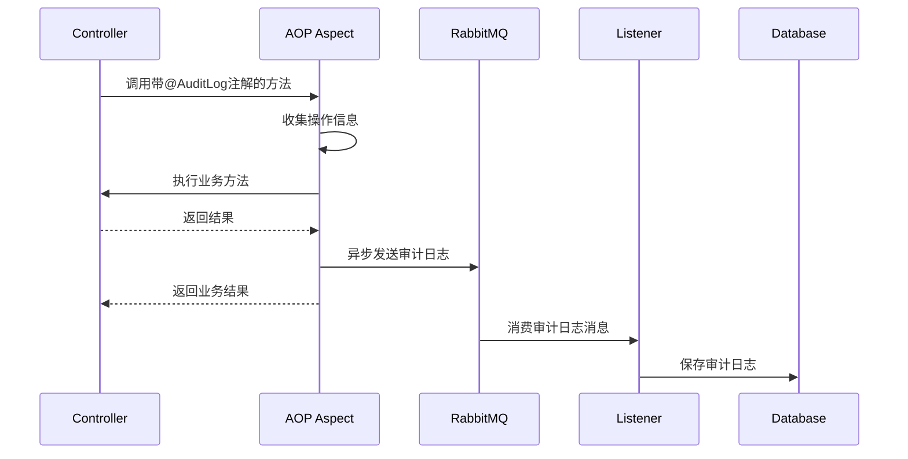

# 审计日志模块实现说明

## 概述

审计日志模块实现了对系统敏感操作的自动记录和追踪，满足需求1.6和6.9的要求。该模块采用AOP切面拦截、RabbitMQ异步处理的架构，确保审计日志记录不影响主业务流程的性能。

## 架构设计

### 组件结构

```
lab-common/
├── annotation/
│   └── AuditLog.java              # 审计日志注解
├── aspect/
│   └── AuditLogAspect.java        # AOP切面，拦截敏感操作
├── config/
│   └── RabbitMQConfig.java        # RabbitMQ配置
└── entity/
    └── AuditLog.java              # 审计日志实体

lab-service-user/
├── listener/
│   └── AuditLogListener.java     # RabbitMQ消息监听器
├── mapper/
│   └── AuditLogMapper.java       # 数据访问层
├── service/
│   ├── AuditLogService.java      # 服务接口
│   └── impl/
│       └── AuditLogServiceImpl.java  # 服务实现
└── controller/
    └── AuditLogController.java   # 审计日志查询接口
```

### 工作流程

1. **拦截阶段**：AOP切面拦截带有`@AuditLog`注解的方法
2. **记录阶段**：收集操作信息（用户、时间、请求参数、响应结果等）
3. **异步发送**：将审计日志对象发送到RabbitMQ队列
4. **持久化**：消息监听器从队列消费消息并保存到数据库
5. **查询**：提供REST API查询审计日志



## 使用方法

### 1. 添加审计日志注解

在需要记录审计日志的Controller方法上添加`@AuditLog`注解：

```java
@PostMapping
@PreAuthorize("hasRole('ADMIN')")
@AuditLog(operationType = "CREATE", businessType = "USER", description = "创建用户")
public Result<Long> createUser(@Valid @RequestBody UserDTO userDTO) {
    Long userId = userService.createUser(userDTO);
    return Result.success(userId);
}
```

### 2. 注解参数说明

- `operationType`: 操作类型，如CREATE、UPDATE、DELETE、PERMISSION_CHANGE等
- `businessType`: 业务类型，如USER、ROLE、MATERIAL、HAZARDOUS_CHEMICAL等
- `description`: 操作描述，简要说明操作内容

### 3. 自动记录的信息

审计日志会自动记录以下信息：

**用户信息**：
- 用户ID（从请求头X-UserId获取）
- 用户名（从请求头X-Username获取）
- 真实姓名（从请求头X-RealName获取）

**请求信息**：
- 请求方法（GET、POST、PUT、DELETE等）
- 请求URL
- 请求参数（自动序列化为JSON）
- IP地址（支持X-Forwarded-For和X-Real-IP）
- User-Agent

**响应信息**：
- 响应结果（自动序列化为JSON，限制2000字符）
- 操作状态（1-成功，2-失败）
- 错误信息（如果操作失败）
- 执行时长（毫秒）

**时间信息**：
- 操作时间
- 创建时间

## 查询审计日志

### API接口

```
GET /api/v1/reports/audit-logs
```

### 查询参数

- `page`: 页码（默认1）
- `size`: 每页数量（默认10）
- `userId`: 用户ID（可选）
- `operationType`: 操作类型（可选）
- `businessType`: 业务类型（可选）
- `startTime`: 开始时间（可选，格式：yyyy-MM-dd HH:mm:ss）
- `endTime`: 结束时间（可选，格式：yyyy-MM-dd HH:mm:ss）

### 示例请求

```bash
curl -X GET "http://localhost:8081/api/v1/reports/audit-logs?page=1&size=10&operationType=CREATE&businessType=USER" \
  -H "Authorization: Bearer {token}"
```

### 响应示例

```json
{
  "code": 200,
  "message": "success",
  "data": {
    "total": 100,
    "records": [
      {
        "id": 1,
        "userId": 1,
        "username": "admin",
        "realName": "管理员",
        "operationType": "CREATE",
        "businessType": "USER",
        "operationDesc": "创建用户",
        "requestMethod": "POST",
        "requestUrl": "/api/v1/system/users",
        "requestParams": "{\"username\":\"test\"}",
        "responseResult": "{\"code\":200,\"data\":123}",
        "ipAddress": "192.168.1.100",
        "userAgent": "Mozilla/5.0...",
        "operationTime": "2024-01-01 10:00:00",
        "executionTime": 150,
        "status": 1,
        "createdTime": "2024-01-01 10:00:00"
      }
    ]
  }
}
```

## 数据库表结构

审计日志表（audit_log）已配置为只读模式，防止数据被篡改：

```sql
CREATE TABLE audit_log (
    id BIGINT PRIMARY KEY AUTO_INCREMENT,
    user_id BIGINT,
    username VARCHAR(50),
    real_name VARCHAR(50),
    operation_type VARCHAR(50) NOT NULL,
    business_type VARCHAR(50) NOT NULL,
    business_id BIGINT,
    operation_desc VARCHAR(500) NOT NULL,
    request_method VARCHAR(10),
    request_url VARCHAR(500),
    request_params TEXT,
    response_result TEXT,
    ip_address VARCHAR(50),
    user_agent VARCHAR(500),
    operation_time DATETIME NOT NULL,
    execution_time INT,
    status TINYINT DEFAULT 1,
    error_message TEXT,
    created_time DATETIME DEFAULT CURRENT_TIMESTAMP,
    INDEX idx_user_id (user_id),
    INDEX idx_operation_type (operation_type),
    INDEX idx_business_type (business_type),
    INDEX idx_operation_time (operation_time)
) ENGINE=InnoDB DEFAULT CHARSET=utf8mb4;
```

**注意**：在生产环境中，应该通过数据库权限控制确保audit_log表只有INSERT和SELECT权限，没有UPDATE和DELETE权限。

## 配置说明

### RabbitMQ配置

在`application.yml`中配置RabbitMQ连接：

```yaml
spring:
  rabbitmq:
    host: localhost
    port: 5672
    username: guest
    password: guest
    virtual-host: /
    listener:
      simple:
        acknowledge-mode: auto
        retry:
          enabled: true
          max-attempts: 3
```

### 队列配置

审计日志队列名称：`audit.log.queue`

队列配置在`RabbitMQConfig`中，采用持久化队列确保消息不丢失。

## 属性测试

### 属性3：敏感操作被记录到审计日志

**验证需求**：1.6, 6.9

**测试内容**：
1. 审计日志记录包含操作时间
2. 审计日志记录包含操作人信息（用户ID、用户名）
3. 审计日志记录包含操作类型
4. 审计日志记录包含业务类型
5. 审计日志记录包含操作描述

**测试文件**：`lab-service-user/src/test/java/com/lab/user/property/AuditLogPropertyTest.java`

**运行测试**：
```bash
mvn test -Dtest=AuditLogPropertyTest
```

## 性能考虑

1. **异步处理**：使用RabbitMQ异步写入，不阻塞主业务流程
2. **消息持久化**：RabbitMQ队列持久化，防止消息丢失
3. **批量处理**：可以配置消息监听器批量消费（可选优化）
4. **索引优化**：在常用查询字段上建立索引
5. **数据归档**：建议定期归档历史审计日志到冷存储

## 安全性

1. **数据不可篡改**：审计日志表应配置为只读（只有INSERT和SELECT权限）
2. **敏感信息脱敏**：密码等敏感字段不记录到审计日志
3. **访问控制**：只有管理员角色可以查询审计日志
4. **数据保留**：审计日志至少保留3年

## 已实现的功能

- [x] 3.1 创建审计日志数据表
- [x] 3.2 实现审计日志记录（AOP切面拦截敏感操作，异步写入RabbitMQ）
- [x] 3.3 编写审计日志属性测试（属性3：敏感操作被记录到审计日志）
- [x] 3.4 实现审计日志查询接口

## 下一步工作

1. 在其他服务模块（material、inventory、approval）中添加审计日志注解
2. 配置数据库权限，确保audit_log表只读
3. 实现审计日志导出功能（Excel/PDF）
4. 配置审计日志定期归档任务
5. 添加审计日志统计报表

## 示例：已添加审计日志的操作

### 用户管理
- 创建用户：`@AuditLog(operationType = "CREATE", businessType = "USER", description = "创建用户")`
- 更新用户：`@AuditLog(operationType = "UPDATE", businessType = "USER", description = "更新用户")`
- 删除用户：`@AuditLog(operationType = "DELETE", businessType = "USER", description = "删除用户")`

### 角色管理
- 创建角色：`@AuditLog(operationType = "CREATE", businessType = "ROLE", description = "创建角色")`
- 分配权限：`@AuditLog(operationType = "UPDATE", businessType = "ROLE_PERMISSION", description = "分配角色权限")`

## 故障排查

### 审计日志未记录

1. 检查RabbitMQ是否正常运行
2. 检查方法是否添加了`@AuditLog`注解
3. 检查AOP是否生效（查看日志）
4. 检查RabbitMQ队列是否有消息堆积

### 查询审计日志失败

1. 检查用户是否有ADMIN角色
2. 检查数据库连接是否正常
3. 检查audit_log表是否存在

### 性能问题

1. 检查RabbitMQ消息堆积情况
2. 检查数据库索引是否正常
3. 考虑增加消息监听器数量
4. 考虑对历史数据进行归档
